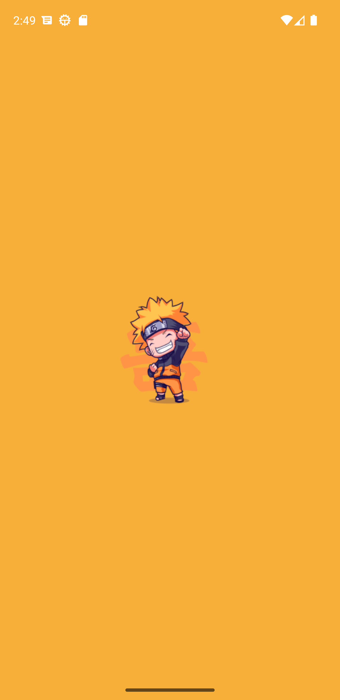
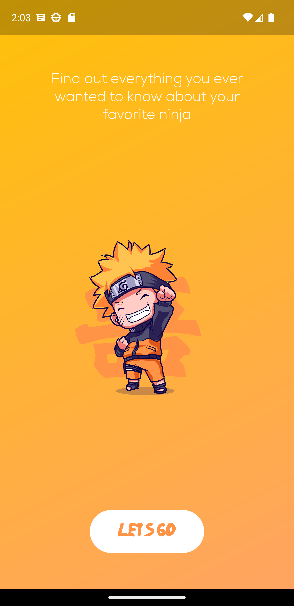
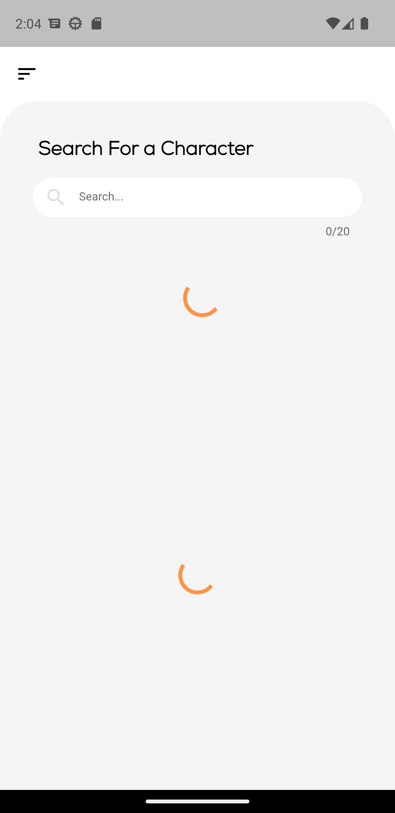
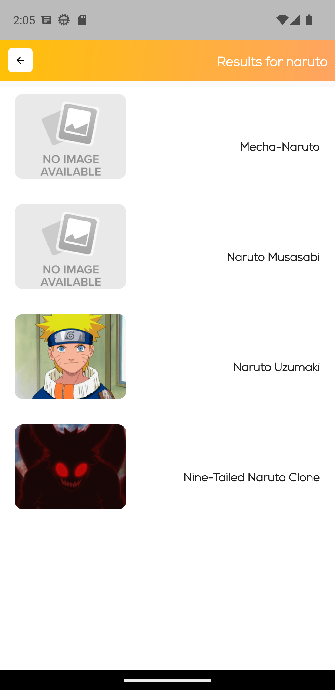
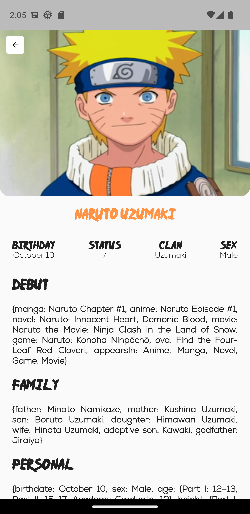

# Naructionary

This is a dictionary of all the characters of Naruto. Their abilities, their clans and their jutsus won't be a secret for you anymore !

# This has the following features

- List of characters (random)
- List of characters (by clan)
- Characters search
- Read character informations

# What's left ?

I have still have to add some additional features as :

- favorite characters system
- List of characters (by village)
- List of characters (by teams)
- Internationalisation

